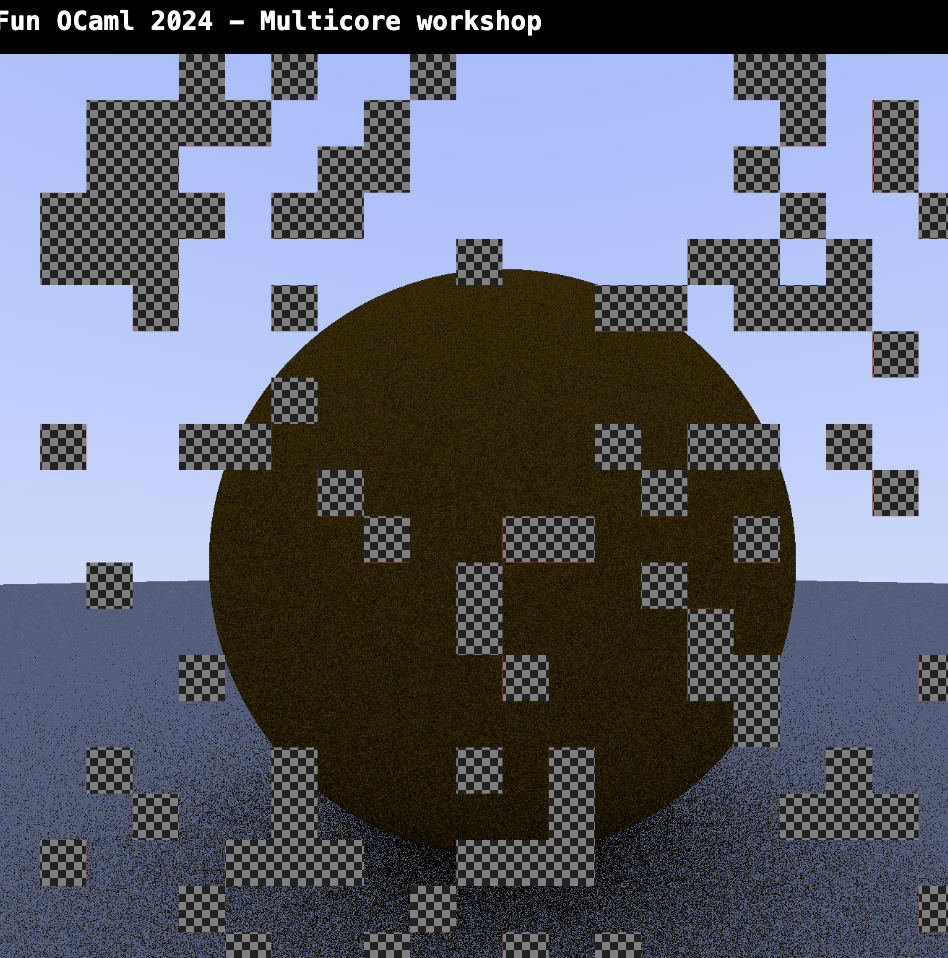

# Fun OCaml workshop &mdash; Concurrency and Parallelism



We're going to build a distributed ray tracer!

We have written a ray tracer as a library.

We have also written a server that manages the rendering of images.

Your job is to write an "actor" or client that

1. requests rendering jobs from the server,
2. renders the job,
3. respond to server with the rendered images, and
4. repeats

and does that as quickly as possible.

Who completes the most rendering jobs?

## 0. Background

[Concurrent and Parallel Programming with OCaml 5](https://speakerdeck.com/kayceesrk/concurrent-and-parallel-programming-with-ocaml-5)

Also, we are here to help. Feel free to ask any questions!

## 1. Install

Clone the repository and install dependencies:

```shell
$ opam pin add . --with-version=dev
```

## 2. Test

You can run the server locally:

```shell
$ dune exec funocaml_server
```

Visit http://localhost:8080/ with your browser.

You can then run some actors with the local server:

```shell
$ dune exec -- ./test/test_eio.exe $USER
$ dune exec -- ./test/test_picos_io_cohttp.exe $USER
```

You can also connect to our server by specifying the server ip:

```shell
$ dune exec -- ./test/test_eio.exe $USER $SERVER
$ dune exec -- ./test/test_picos_io_cohttp.exe $USER $SERVER
```

## 3. Multiple requests

Modify the actor to take multiple (max 3) requests concurrently and render them.

<details><summary>Tip</summary>You could just fork a few fibers.  With Eio you
might use a <a
href="https://github.com/ocaml-multicore/eio?tab=readme-ov-file#switches">switch</a>
or e.g.  <a
href="https://ocaml-multicore.github.io/eio/eio/Eio/Fiber/index.html#val-all">all</a>.
With Picos you could use the sample <a
href="https://ocaml-multicore.github.io/picos/doc/picos_std/Picos_std_structured/index.html">structured
concurrency library</a>, which has e.g. the <code>Flock</code> mechanism and
<code>Run.all</code>.  </details>

Can you also render the requests in parallel?

<details><summary>Tip</summary>With Eio you'd use a <a
href="https://github.com/ocaml-multicore/eio?tab=readme-ov-file#domain-manager">domain
manager</a>.  Some of <a
href="https://ocaml-multicore.github.io/picos/doc/picos_mux/index.html">the
Picos sample schedulers</a> directly support multi-threading, which means that
multiple domains are automatically used to run fibers.</details>

## 4. Subdivide and render in parallel

To utilize all the cores, split the request and render subjobs in parallel.

The "actor" library has operations to split jobs and join images.

<details><summary>Tip</summary>You might want to use a concurrent data
structure to manage jobs that you'll then execute in parallel.  <a
href="https://github.com/ocaml-multicore/saturn">Saturn</a> and <a
href="https://github.com/ocaml-multicore/kcas">Kcas</a> provide concurrent data
structures.  Kcas also provides blocking data structures that work with your
scheduler either through domain-local-await (supported by Eio) or <a
href="https://github.com/ocaml-multicore/kcas/pull/204">through Picos</a>.

Which is better for parallelism? FIFO or LIFO?</details>

## 5. More speedups?

Does your program use all the cores effectively?

If not, figure out the bottlenecks and modify your program to avoid them.

## 6. Distributed rendering

Let's try to run our actors against the server to render some more complex
scenes.

## 7. More challenge?

Ideas:

- Use [Domainslib](https://github.com/ocaml-multicore/domainslib) or raw domains
  to parallelize rendering.

- Optimize the ray tracer.
